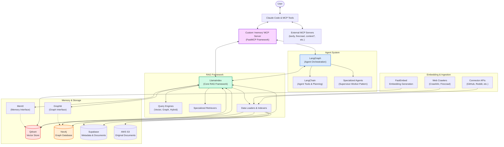
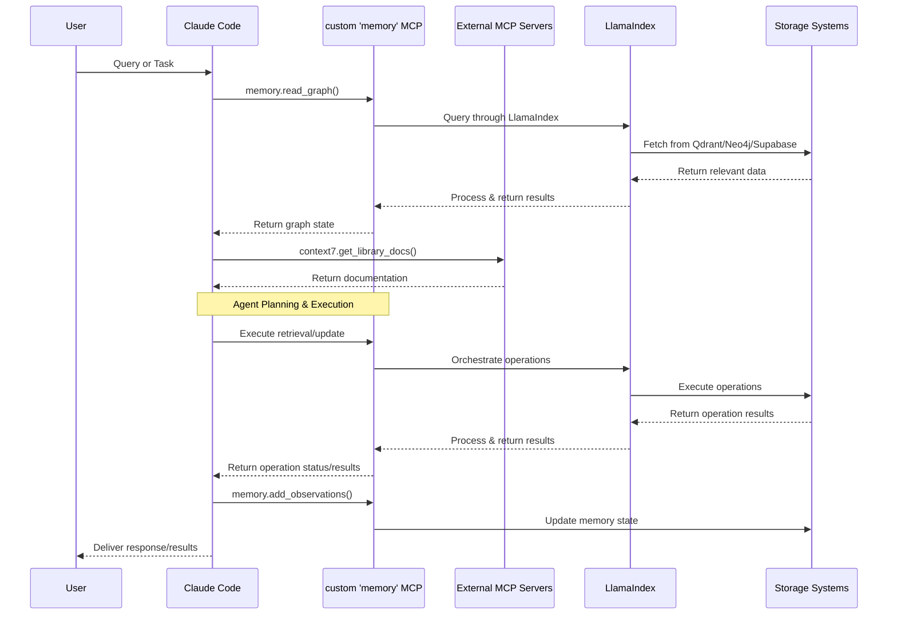

# Enhanced Mem-Vector RAG: System Architecture, Requirements, and Implementation Plan

**Version:** 1.0
**Date:** 2025-05-05

## 1. Introduction & Goals

This document outlines the architecture, requirements, and phased implementation plan for the "Enhanced Mem-Vector RAG" project.

### 1.1. Project Goal

To design and implement a sophisticated, personal AI Agent system focused on advanced memory/knowledge management, software development assistance (specifically AI/ML, Python, AWS, Next.js), research, learning, and managing personal/work information.

### 1.2. Core Use Case

A persistent, shared memory and knowledge fabric accessible by both the user (primarily via Claude Code and other MCP-enabled tools) and multiple AI agents. The system will enable collaborative task execution (e.g., code generation, research report generation, data analysis), continuous learning, and personalized knowledge retrieval.

### 1.3. Development Philosophy

- **Local-First:** Initial development and deployment will be local, utilizing Docker for backend services and `stdio` for the MCP server connection.
- **Cloud-Ready:** The architecture is designed with future cloud deployment (AWS, Cloudflare Workers) in mind.
- **Modularity:** Components are designed to be loosely coupled for maintainability and scalability.
- **SOTA Foundation:** Leverage state-of-the-art libraries and techniques (LlamaIndex, LangGraph, Qdrant, Neo4j/Graphiti, Mem0, FastEmbed, FastMCP) while avoiding premature over-engineering.
- **Agentic Development:** Utilize Claude Code with its integrated MCP servers, guided by `CLAUDE.md`, for implementation.

## 2. System Architecture

### 2.1. Interaction Layer

- **Primary Interface:** Model Context Protocol (MCP) Server.
  - **Framework:** Custom Python server built using **FastMCP (gofastmcp.com)**.
  - **Binding (Initial):** `stdio` for local interaction with Claude Code.
  - **Binding (Future):** HTTP/SSE for remote access (e.g., via Cloudflare Workers).
  - **Authentication:** Personal Access Tokens (PAT) initially; OAuth 2.1 planned for remote deployment.
  - **Core Endpoints:**
    - `/search.hybrid`: Executes Hybrid RAG + Web search queries via LlamaIndex.
    - `/graph.query`: Executes Cypher queries against Neo4j (via Graphiti or LlamaIndex `Neo4jGraphStore`).
    - `/memory.upsert`, `/memory.fetch`, `/memory.delete`, etc.: Manages vector/semantic memory via Mem0/Qdrant.
    - `/rules.validate`: Checks graph mutations against Neo4j/APOC rules.
    - `/ingest.url`, `/ingest.repo`, `/ingest.text`, etc.: Triggers specific ingestion workflows.
- **Secondary UI (Future):** Chainlit web application for direct interaction, leveraging LlamaIndex callbacks for transparency.

### 2.2. Agent Orchestration & Logic Layer

- **Orchestration Framework:** LangGraph
  - Manages complex, potentially cyclic workflows.
  - Implements Supervisor-Worker pattern:
    - _Supervisor:_ Decomposes tasks, routes to specialists, manages state.
    - _Specialists:_ Domain-specific agents (e.g., `ResearchAgent`, `CodeAgent`, `IngestionAgent`) built using LangChain.
    - _Critic/Reflection Agent:_ Evaluates outputs, triggers self-correction loops (Reflection-reinforced learning).
  - Manages short-term memory (STM) via built-in state.
- **Agent Framework:** LangChain
  - Provides building blocks for Specialist agents (LLM wrappers, prompt templates, output parsers, tool abstractions).
  - Implements planning engines (Plan-and-Execute, ReAct).
  - Integrates with LlamaIndex for RAG capabilities within agents.
  - Uses `ConversationBufferMemory` for session-specific context within individual agent runs if needed beyond LangGraph state.

### 2.3. Memory & Knowledge Layer

- **Short-Term Memory (STM):** Managed by LangGraph state (thread-scoped checkpoints).
- **Long-Term Memory (LTM - Semantic/Episodic):**
  - **Vector Store:** Qdrant (Dockerized locally). Stores dense vector embeddings.
  - **Memory Interface:** Mem0 (Open Source, self-hosted library/service). Provides intelligent interface to Qdrant, adding scoring, personalization, potentially abstracting storage details. Used by LlamaIndex retrievers or directly by agents/MCP server.
- **Procedural Memory (Workflows/Tasks):**
  - **Graph Database:** Neo4j (Dockerized locally). Stores task graphs, workflows, relationships.
  - **Interface/Framework:** Graphiti (Python library interacting with Neo4j). Enables modeling and querying of temporally-aware procedural knowledge. Can be queried directly or via LlamaIndex.
- **Structured Data/Metadata:**
  - **Database:** Supabase (PostgreSQL) (Dockerized locally or using Supabase cloud). Stores user profiles, project metadata, configuration, relational data extracted during ingestion, links to original documents.
- **Knowledge Representation:**
  - **Ontology:** OWL files managed in Git, defining concepts and relationships.
  - **Semantic Layer:** RDF triples used for annotation. Imported into Neo4j using `n10s` library/procedures for graph enrichment and SPARQL querying capabilities (via LlamaIndex or directly).

### 2.4. Data Indexing, Retrieval & Generation Layer (RAG Core)

- **Core Framework:** LlamaIndex
  - Orchestrates the end-to-end RAG pipeline.
  - Connects to diverse data sources using built-in and custom loaders.
  - Handles data transformation and chunking.
  - Manages indexing into Qdrant (vectors) and Neo4j (`Neo4jGraphStore` for graph data).
  - Provides query engines and retrievers for:
    - _Vector Search:_ Querying Qdrant (likely via Mem0 interface).
    - _Keyword Search:_ BM25 or similar (potentially via Qdrant sparse vectors or separate index).
    - _Graph Search:_ Querying Neo4j/Graphiti using natural language (`text2cypher`) or structured Cypher queries via `KnowledgeGraphQueryEngine` or custom retrievers.
    - _Hybrid Retrieval:_ Combining vector, keyword, and potentially graph results.
  - Integrates with LangChain agents and the FastMCP server for retrieval requests.
- **Embedding Generation:**
  - **Models:** OpenAI `text-embedding-3-small` / Cohere `embed-english-v3` (or similar SOTA).
  - **Tooling:** FastEmbed library used within the ingestion pipeline for efficient, local embedding generation.
- **Retrieval Strategy:**
  - _Hybrid RAG:_ Combine Qdrant vector search (via Mem0/LlamaIndex) + BM25 keyword search.
  - _KAG (Knowledge-Augmented Generation):_ Inject relevant subgraphs from Neo4j/Graphiti (retrieved via LlamaIndex) into the LLM context.
  - _Web Search Fusion:_ Integrate Tavily API results (via LlamaIndex tool or direct call) into the final context provided to the LLM.

### 2.5. Ingestion & Data Processing Layer

- **Goal:** Populate the memory/knowledge layers from diverse sources, both automatically and manually.
- **Sources:** Websites, blogs, social media (Reddit, X), research papers (arXiv), code repositories (GitHub), email (IMAP), local files/text.
- **Tools:**
  - _Data Loading:_ LlamaIndex Readers/Loaders (primary mechanism).
  - _Web Scraping:_ Crawl4AI (LLM-focused), Firecrawl (structured output), Scrapy (complex sites).
  - _Browser Automation:_ Playwright (via MCP server).
  - _APIs:_ Official platform APIs (Reddit, X, GitHub, arXiv via MCP).
  - _Email:_ Python `imaplib`.
  - _Code:_ GitHub Webhooks triggering local processing (using `repomix` MCP potentially).
- **Workflow:**
  1. _Discover/Fetch:_ Get raw content (HTML, PDF, JSON, text, code).
  2. _Transform:_ Clean, parse, chunk data (e.g., Firecrawl to Markdown, LlamaIndex transformations).
  3. _Enrich:_ Add metadata (source URL, timestamp via `time` MCP), extract entities/relationships (potentially using LLM calls via LangChain).
  4. _Embed:_ Generate vector embeddings using FastEmbed.
  5. _Store:_
     - Embeddings -> Qdrant (via Mem0/LlamaIndex indexer).
     - Structured Data/Relationships -> Neo4j (via Graphiti/LlamaIndex indexer/`n10s`).
     - Metadata/Links -> Supabase.
     - Original Files -> AWS S3 / Supabase Storage.
- **Triggers:** Scheduled jobs (GitHub Actions / local cron), Git hooks, manual calls via FastMCP `/ingest.*` endpoints.
- **Queueing:** RabbitMQ (Dockerized) recommended for decoupling ingestion triggers from processing workers.

### 2.6. Cross-Cutting Concerns

- **Deployment (Initial):** Docker Compose for local Qdrant, Neo4j, Supabase, RabbitMQ. Python environment managed by `uv`. FastMCP server runs via `stdio`.
- **Deployment (Future):** Backend services on AWS (ECS/EKS, RDS/AuraDB, Qdrant Cloud/Managed). MCP Server on Cloudflare Workers.
- **Observability:** Grafana + Prometheus. Scrape metrics from Qdrant (`/metrics`), Neo4j (Ops Manager/Exporter), FastMCP server (custom metrics), potentially LlamaIndex/LangChain callbacks.
- **Versioning:** Git for code, configuration, OWL ontologies. Neo4j CDC streams for graph data changes.
- **Rules/Constraints:** Neo4j APOC triggers/constraints based on OWL/RDF schema (imported via `n10s`) for graph data integrity. Validation via `/rules.validate` MCP endpoint.
- **Security:** Manage secrets via `.env` files and environment variables (local) / secrets manager (cloud). PAT/OAuth2 for MCP access. RBAC mapping for database access.

## 3. Functional Requirements

- **FR1:** Ingest data from specified sources (web, code, email, social, papers, manual text/URLs).
- **FR2:** Store ingested data appropriately: vectors in Qdrant, graph data in Neo4j, metadata in Supabase, originals in file storage.
- **FR3:** Provide MCP endpoints for hybrid search (`/search.hybrid`), graph queries (`/graph.query`), and direct memory operations (`/memory.*`).
- **FR4:** Support manual ingestion triggers via MCP endpoints (`/ingest.*`).
- **FR5:** Enable agents (built with LangChain/LangGraph) to utilize the RAG pipeline (via LlamaIndex) and memory stores for tasks (research, coding, etc.).
- **FR6:** Implement basic Supervisor-Worker agent orchestration using LangGraph.
- **FR7:** Implement reflection/criticism loop for agent output improvement.
- **FR8:** Store and query structured knowledge using OWL/RDF via Neo4j.
- **FR9:** Maintain context and state via the `memory` MCP server interface.

## 4. Non-Functional Requirements

- **NFR1 (Performance):** Local query latency via MCP should be acceptable for interactive use with Claude Code.
- **NFR2 (Scalability):** Architecture should be modular to allow adding new agents, data sources, and scaling components independently (especially for future cloud deployment).
- **NFR3 (Reliability):** Implement basic error handling and logging throughout the system. Core services (DBs) should be stable (via Docker).
- **NFR4 (Security):** Securely manage API keys and credentials. Implement basic authentication for the MCP server.
- **NFR5 (Maintainability):** Adhere to coding standards (`CLAUDE.md`), use modular design (SOLID), provide documentation (via `memory` MCP and code docstrings), include tests.
- **NFR6 (Observability):** Provide basic monitoring capabilities via Grafana/Prometheus for core components (Qdrant, Neo4j, MCP server).
- **NFR7 (Usability):** Primary interface (MCP) should be well-defined and usable by Claude Code according to the FastMCP specification.

## 5. Implementation Plan (Phased Approach)

### Phase 0: Setup & Core Infrastructure (Foundation)

- Initialize Git repository (`enhanced-mem-vector-rag`).
- Setup `uv` environment and `pyproject.toml` with initial dependencies (FastMCP, Python basics).
- Create core directory structure (`agents`, `ingestion`, `memory_interfaces`, `mcp_server`, `core`, `tests`, `config`, `scripts`, `docs`).
- Setup Docker Compose file (`docker-compose.yml`) for:
  - Qdrant
  - Neo4j (with APOC plugin)
  - Supabase (PostgreSQL)
  - RabbitMQ (for ingestion queue)
- Implement basic configuration loading (`.env` via `python-dotenv`).
- Setup pre-commit hooks (Black, isort, Ruff).
- Write initial `README.md` and copy `CLAUDE.md` (v4).
- _Goal: Runnable Docker stack, basic Python project structure._

### Phase 1: Core Memory Backend & MCP Server Foundation

- Implement basic FastMCP server structure (`mcp_server/main.py`).
- Establish connections to Qdrant, Neo4j, Supabase from the Python backend (e.g., in `core/db_connections.py`).
- Implement basic Mem0 interface (`memory_interfaces/mem0_interface.py`) wrapping Qdrant client for simple upsert/retrieve.
- Implement basic Graphiti interface (`memory_interfaces/graphiti_interface.py`) for basic Neo4j node/relationship creation.
- Implement initial FastMCP endpoints:
  - `/memory.upsert_vector` (using Mem0 interface -> Qdrant)
  - `/memory.fetch_vector` (using Mem0 interface -> Qdrant)
  - `/graph.create_node` (using Graphiti interface -> Neo4j)
  - `/graph.query_cypher` (basic direct Cypher execution)
- Implement basic `stdio` binding for FastMCP server.
- Write basic unit tests for connections and interfaces.
- _Goal: MCP server can connect to DBs and perform basic read/write operations._

### Phase 2: Basic Ingestion, Embedding & Storage

- Implement basic ingestion pipeline structure (`ingestion/pipeline.py`).
- Integrate FastEmbed (`core/embedding.py`).
- Implement LlamaIndex basic file loader (e.g., TextLoader).
- Implement manual ingestion trigger via FastMCP `/ingest.text` endpoint.
  - Endpoint receives text -> calls ingestion pipeline -> uses LlamaIndex loader -> uses FastEmbed -> stores embedding via `/memory.upsert_vector` -> stores metadata in Supabase -> potentially creates basic node via `/graph.create_node`.
- Setup RabbitMQ producer (in MCP endpoint) and consumer (in a separate ingestion worker script `ingestion/worker.py`).
- Write tests for embedding and basic ingestion flow.
- _Goal: Manually ingest text, embed it, and store vector + metadata._

### Phase 3: Basic RAG & Search Endpoint

- Implement basic LlamaIndex vector retriever (`retrievers/vector_retriever.py`) using the Mem0 interface/Qdrant.
- Implement basic LlamaIndex query engine using the vector retriever.
- Implement FastMCP `/search.hybrid` endpoint (initially just vector search) using the LlamaIndex query engine.
- Write tests for the retriever and search endpoint.
- _Goal: Search ingested text vectors via MCP._

### Phase 4: Basic Agent Structure

- Setup basic LangGraph state definition.
- Implement LangGraph Supervisor node (basic task routing logic).
- Implement one simple LangChain Specialist agent (e.g., `BasicResearcherAgent`) that uses the `/search.hybrid` MCP endpoint via a LangChain tool.
- Wire the Supervisor and Specialist in a simple LangGraph graph.
- Create a script (`scripts/run_agent.py`) to interact with the LangGraph agent.
- _Goal: A simple agent can perform a vector search._

### Phase 5: Enhance RAG & Graph Integration

- Integrate BM25/keyword search into Qdrant (sparse vectors) or setup separate sparse index.
- Update LlamaIndex retriever and `/search.hybrid` endpoint to perform true hybrid (vector + keyword) search.
- Integrate Tavily web search into `/search.hybrid` fusion logic (via LlamaIndex tool or direct API call).
- Setup LlamaIndex `Neo4jGraphStore`.
- Implement KAG: Modify agents/retrievers to query Neo4j via LlamaIndex (`KnowledgeGraphQueryEngine` or custom Cypher) using `/graph.query_cypher` or a new `/graph.query_llama` endpoint. Inject graph context.
- Implement `/rules.validate` endpoint calling Neo4j APOC procedures.
- Define initial OWL/RDF schema and import using `n10s`.
- _Goal: Full Hybrid RAG + KAG retrieval available via MCP and usable by agents._

### Phase 6: Expand Ingestion Sources

- Implement ingestion connectors using LlamaIndex/Crawl4AI/Firecrawl/APIs/IMAP for:
  - Web URLs (via `/ingest.url`)
  - Code Repositories (via `/ingest.repo` and Git hooks)
  - Email
  - arXiv (via `arxiv-mcp-server` + processing)
  - Reddit/X (via APIs)
- Refine ingestion pipeline to handle different data types, extract relationships for Neo4j, and store originals in S3/Supabase Storage.
- Implement scheduled ingestion triggers (e.g., GitHub Action calling MCP endpoint).
- _Goal: System can ingest data from multiple key sources._

### Phase 7: Advanced Agents & Planning

- Implement Critic/Reflection agent and loop in LangGraph.
- Develop more specialized agents (`CodeAgent`, `ReportAgent`).
- Integrate advanced planning (Plan-and-Execute, Graphiti procedural planning) into Supervisor/Specialists.
- Refine agent tool usage (leveraging more MCP capabilities).
- _Goal: More capable, self-improving multi-agent system._

### Phase 8: Refinement, Observability & Optimization

- Implement comprehensive Grafana dashboards monitoring Qdrant, Neo4j, Supabase, FastMCP server metrics, RabbitMQ queue lengths.
- Implement APOC rules for data validation triggered by graph writes.
- Implement memory optimization strategies (tiered storage in Qdrant, consolidation jobs).
- Refine error handling and logging across the system.
- Add comprehensive integration tests.
- _Goal: A robust, observable, and optimized system._

### Phase 9: UI & Cloud Deployment (Future)

- Develop Chainlit UI for direct interaction.
- Implement HTTP/SSE binding for FastMCP server.
- Deploy FastMCP server to Cloudflare Workers.
- Deploy backend services (Qdrant, Neo4j, Supabase, RabbitMQ, Agent Workers) to AWS (or chosen cloud).
- Configure cloud monitoring and security.
- _Goal: A cloud-hosted, remotely accessible system._

## 6. Development Environment & Tooling

- **OS:** Linux/macOS/WSL2 recommended.
- **Python:** 3.11+
- **Package Manager:** `uv`
- **Containerization:** Docker & Docker Compose
- **Version Control:** Git & GitHub account
- **Databases/Services (Local):** Qdrant, Neo4j (with APOC), PostgreSQL (via Supabase Docker or cloud), RabbitMQ.
- **IDE:** VS Code (recommended) or preferred editor.
- **Claude:** Claude Code extension/access with the specified external MCP servers enabled.
- **Secrets Management:** `.env` file locally.

## 7. Next Steps

Proceed with **Phase 0: Setup & Core Infrastructure**. Use the `CLAUDE.md` guide and this document to instruct Claude Code for each step, starting with initializing the `pyproject.toml` file using `uv`, creating the directory structure, and setting up the `docker-compose.yml` file. Remember to use the `memory` MCP server (once basic endpoints are up in Phase 1) to track progress and decisions throughout the implementation.

## 8. MCP Interaction Flow

