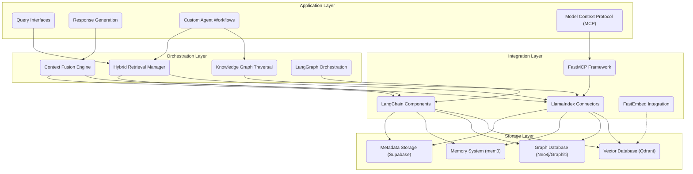
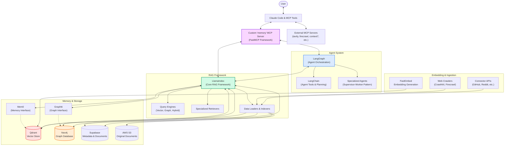
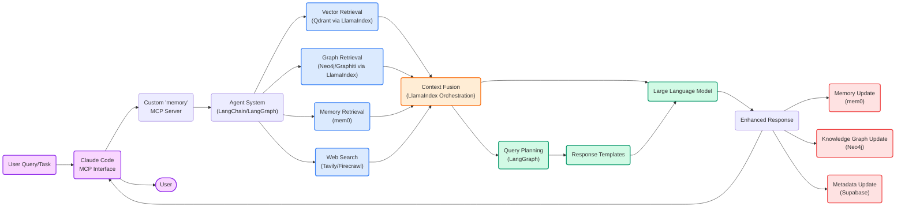
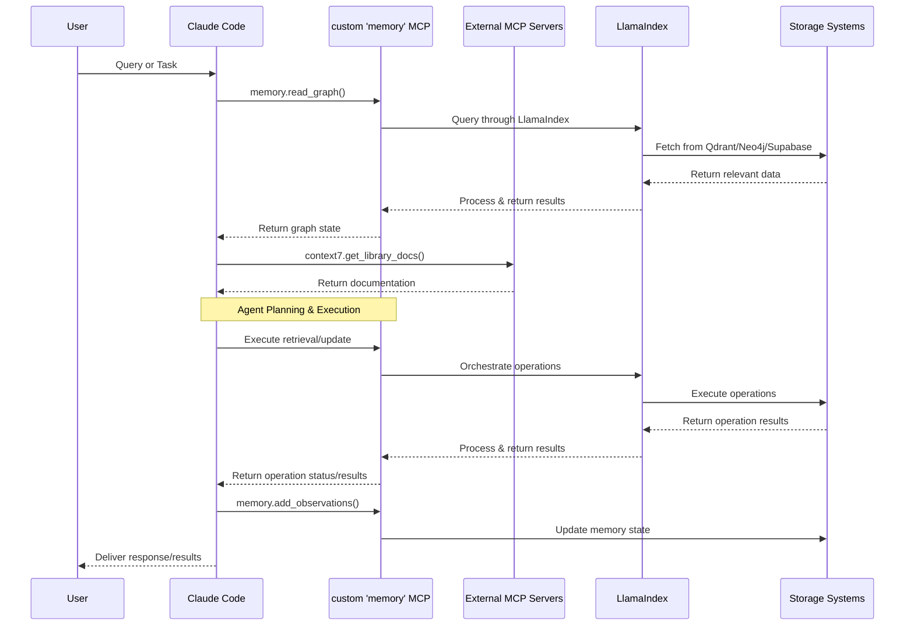
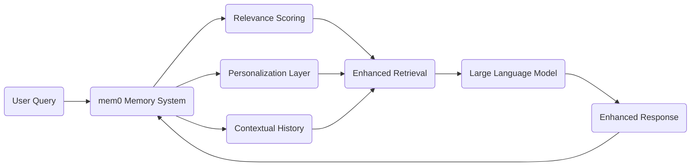
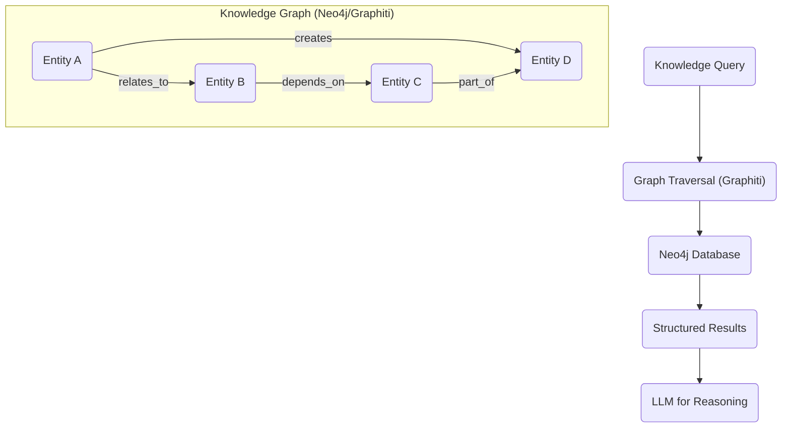
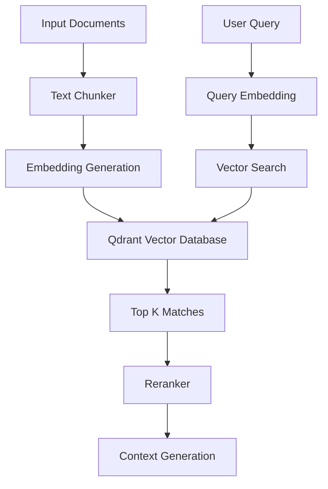
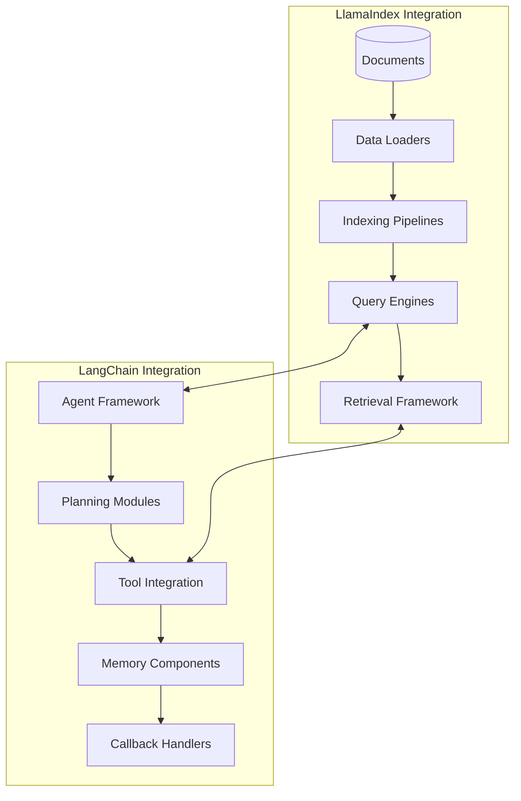
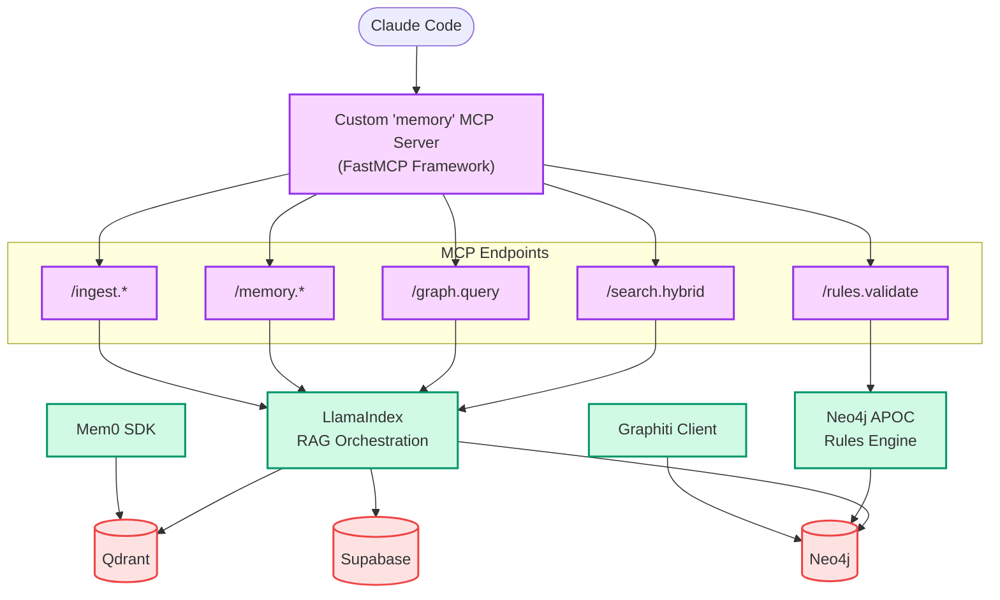

# Enhanced Memory Vector RAG

[](https://opensource.org/licenses/MIT)
[](https://www.python.org/downloads/)
[](https://github.com/BjornMelin/enhanced-mem-vector-rag/graphs/commit-activity)
[](https://makeapullrequest.com)
[](https://github.com/BjornMelin/enhanced-mem-vector-rag/wiki)
[](https://github.com/BjornMelin/enhanced-mem-vector-rag/blob/main/CLAUDE.md)

⚡ Developer-friendly hybrid-RAG toolkit merging Graphiti, Qdrant, mem0, LlamaIndex, and LangChain into one powerful engine.

This implementation creates a sophisticated knowledge retrieval system by integrating KAG methodologies with traditional RAG approaches. It seamlessly combines Graphiti's graph intelligence, Qdrant's vector capabilities, and mem0's memory persistence - all accessible through flexible LlamaIndex and LangChain interfaces for applications requiring both factual accuracy and contextual understanding.

## Table of Contents

- [Overview](#overview)
- [Features](#features)
- [Architecture](#architecture)
- [Getting Started](#getting-started)
  - [Prerequisites](#prerequisites)
  - [Installation](#installation)
  - [Quick Start](#quick-start)
- [Components](#components)
  - [Memory System (mem0)](#memory-system-mem0)
  - [Graph Knowledge Base (Graphiti/Neo4j)](#graph-knowledge-base-graphitineo4j)
  - [Vector Storage (Qdrant)](#vector-storage-qdrant)
  - [Framework Integration (LlamaIndex & LangChain)](#framework-integration-llamaindex--langchain)
- [Usage Examples](#usage-examples)
- [Configuration](#configuration)
- [Benchmarks](#benchmarks)
- [Roadmap](#roadmap)
- [Contributing](#contributing)
- [How to Cite](#how-to-cite)
- [License](#license)
- [Acknowledgements](#acknowledgements)
- [Claude Code Development](#claude-code-development)
- [Deployment](#deployment)

## Overview

Enhanced Memory Vector RAG (EMVR) is a comprehensive framework that combines the strengths of multiple retrieval methodologies to create a more robust, accurate, and contextually aware knowledge system. By integrating graph-based Knowledge-Augmented Generation (KAG) with traditional vector-based Retrieval-Augmented Generation (RAG), EMVR provides superior performance in complex knowledge retrieval tasks.

The system leverages:
- **Graphiti/Neo4j** for structured knowledge representation and graph traversal
- **Qdrant** for efficient vector similarity search
- **mem0** for persistent memory and context management
- **LlamaIndex & LangChain** for flexible orchestration and agent-based workflows

## Features

- 🔄 **Hybrid Retrieval System** - Combines vector similarity search with graph-based knowledge retrieval
- 🧠 **Persistent Memory** - Maintains context and relationships across sessions
- 🔍 **Multi-modal Search** - Query across different data types and structures
- 🔗 **Knowledge Graph Integration** - Leverages structured relationships for improved context
- 🚀 **Framework Flexibility** - Works with both LlamaIndex and LangChain
- 📊 **Extensible Architecture** - Easy to customize and extend for specific use cases
- 🛠️ **Developer-Friendly APIs** - Simple interfaces for complex retrieval operations
- 📈 **Performance Optimization** - Efficient retrieval strategies for reduced latency
- 🐳 **Docker Deployment** - Containerized architecture for easy deployment

## Architecture

EMVR implements a comprehensive layered architecture integrating multiple components for advanced retrieval:

### Layered Architecture



### Comprehensive System Architecture



## Data Flow



### MCP Interaction Flow



## Getting Started

### Prerequisites

- Python 3.11+
- Docker (recommended for Neo4j, Qdrant, and Supabase)
- `uv` for Python package management
- Basic understanding of RAG systems

### Installation

#### Local Development

```bash
# Clone the repository
git clone https://github.com/BjornMelin/enhanced-mem-vector-rag.git
cd enhanced-mem-vector-rag

# Install dependencies using uv
uv pip install -r requirements.txt
```

#### Docker Deployment

```bash
# Navigate to deployment directory
cd emvr/deployment

# Setup environment
./setup_local.sh

# Start services
docker compose up -d
```

### Quick Start

```python
from emvr import EmvrSystem

# Initialize the system
system = EmvrSystem()

# Load data
system.load_documents("path/to/documents")
system.build_knowledge_graph()

# Query the system
response = system.query("What is the relationship between X and Y?")
print(response)
```

## Components

### Memory System (mem0)

The memory component leverages mem0 to maintain persistent context across queries and sessions. This allows the system to:

- Remember previous interactions
- Build cumulative knowledge
- Maintain entity relationships
- Support temporal reasoning



### Graph Knowledge Base (Graphiti/Neo4j)

The graph component uses Graphiti with Neo4j to:

- Store structured relationships between entities
- Enable complex traversal queries
- Support reasoning about interconnected concepts
- Provide explicit knowledge paths



### Vector Storage (Qdrant)

The vector component uses Qdrant to:

- Store and retrieve document embeddings
- Perform efficient similarity search
- Support semantic matching
- Handle large-scale vector operations



### Framework Integration (LlamaIndex & LangChain)

EMVR integrates with both major RAG frameworks:

- **LlamaIndex** - For advanced indexing and retrieval operations
- **LangChain** - For agent-based workflows and tool integration



## Usage Examples

Examples are coming soon. They will demonstrate:

- Basic RAG workflows
- Knowledge graph integration
- Multi-hop reasoning
- Custom retrieval strategies
- Agent-based applications

## Configuration

EMVR can be configured through:

- Configuration files
- Environment variables
- Programmatic settings

Detailed configuration options will be provided in the upcoming documentation.

## Benchmarks

Performance benchmarks comparing EMVR to traditional RAG systems will be available soon.

## Roadmap

- [x] Initial release with core functionality
- [x] Basic documentation
- [x] Agent orchestration implementation
- [x] UI implementation with Chainlit
- [x] Docker containerization and deployment
- [ ] Comprehensive documentation
- [ ] Performance benchmarks
- [ ] Advanced examples
- [ ] Cloud deployment guides
- [ ] Additional vector database integrations
- [ ] Custom agent templates

## Contributing

Contributions are welcome! Please see the [CONTRIBUTING.md](CONTRIBUTING.md) file for guidelines.

## How to Cite

If you use EMVR in your research, please cite:

```bibtex
@software{emvr2025,
  author = {Melin, Bjorn},
  title = {Enhanced Memory Vector RAG: A Hybrid Retrieval Framework},
  year = {2025},
  url = {https://github.com/BjornMelin/enhanced-mem-vector-rag},
  version = {0.1.0}
}
```

## License

This project is licensed under the MIT License - see the [LICENSE](LICENSE) file for details.

## Acknowledgements

- [Graphiti](https://github.com/neo4j/graphiti) for Neo4j integration
- [Qdrant](https://github.com/qdrant/qdrant) for vector database capabilities
- [mem0](https://github.com/mem0ai/mem0) for memory systems
- [LlamaIndex](https://github.com/run-llama/llama_index) for indexing frameworks
- [LangChain](https://github.com/langchain-ai/langchain) for agent orchestration

## Custom MCP Server Implementation

This project implements a custom `memory` MCP server using the FastMCP framework that serves as the central interface between Claude Code and the system's backend components:



### Key MCP Endpoints

| Endpoint | Description | Implementation |
|----------|-------------|----------------|
| `/search.hybrid` | Performs hybrid search across vector and graph stores | Uses LlamaIndex for orchestrating hybrid search across Qdrant and Neo4j |
| `/graph.query` | Executes knowledge graph queries | Translates natural language to Cypher using LlamaIndex's `KnowledgeGraphQueryEngine` |
| `/memory.*` | Operations for memory management | Includes CRUD operations for graph entities and observations |
| `/rules.validate` | Validates operations against defined rules | Uses Neo4j APOC for rule enforcement |
| `/ingest.*` | Handles data ingestion from various sources | Utilizes LlamaIndex data loaders and FastEmbed for embedding generation |

## Claude Code Development

This project provides a detailed development guide for Claude Code users. The guide includes:

- Project overview and technical architecture
- Development workflow and memory protocol
- Coding standards and practices
- Git workflow
- MCP server documentation and usage
- Key architectural components and their roles

For Claude Code development, please refer to [CLAUDE.md](CLAUDE.md) for comprehensive guidelines.

## Deployment

The project includes a complete deployment system using Docker Compose:

### Docker Components

- **MCP Server**: FastAPI server implementing the Model Context Protocol
- **Chainlit UI**: Web interface for user interaction
- **Qdrant**: Vector database for semantic search
- **Neo4j**: Graph database for knowledge graphs
- **Supabase**: PostgreSQL for structured data and metadata
- **Grafana/Prometheus**: Monitoring and observability

### Deployment Options

#### Local Deployment

```bash
# Navigate to deployment directory
cd emvr/deployment

# Set up environment
./setup_local.sh

# Start services using docker-compose
docker compose up -d
```

#### Using Makefile

```bash
cd emvr/deployment
make setup    # Run setup script
make up       # Start all services
```

### Security

The deployment includes comprehensive security features:

- JWT-based authentication
- Role-Based Access Control (RBAC)
- Secure environment variable management
- Container-based isolation

### Monitoring & Observability

Access system metrics and logs through:

- Grafana dashboard: http://localhost:3000
- Prometheus metrics: http://localhost:9090

### Backup & Restore

The system includes scripts for data backup and restoration:

```bash
# Create backup
./scripts/backup.sh

# Restore from backup
./scripts/restore.sh ./backups/emvr_backup_20250506_120000.tar.gz
```

For detailed deployment instructions, see the [deployment README](emvr/deployment/README.md).